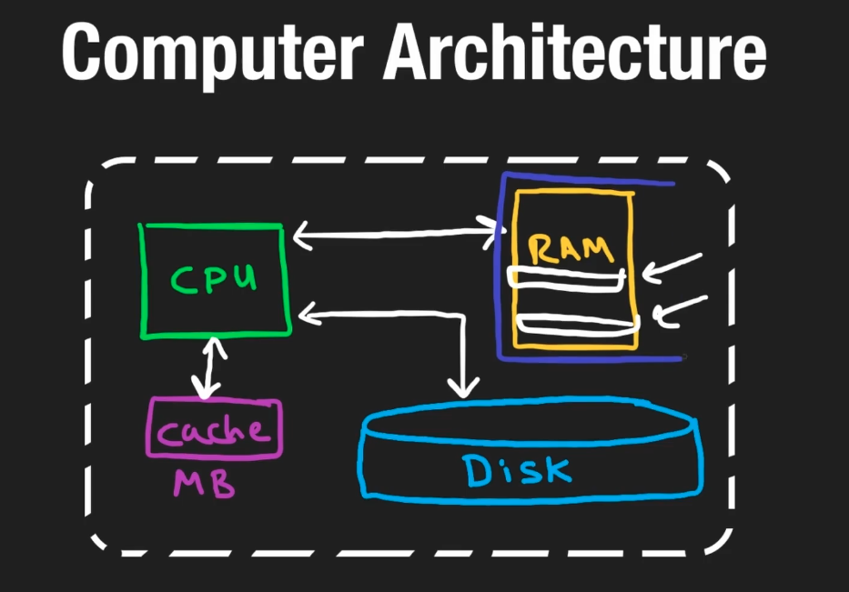

# 1. 计算机架构

在深入了解系统设计过程之前，首先需要理解计算机的构建模块、它们的重要性以及它们在系统设计中所扮演的角色。

## 硬盘（Disk）

硬盘是计算机的主要存储设备，具有**持久性**，即无论计算机处于开机还是关机状态，数据都会被保存。现代计算机的硬盘存储容量通常以 **TB**（太字节）为单位。

回顾一下，1 字节由 8 位组成，而位（bit）是计算机中最小的度量单位——一个二进制值（如 000 或 111）。1 TB 等于 `10^12` 字节（约一万亿字节）。类似 U 盘这样的存储设备可能以 **GB**（吉字节）为单位存储数据，1 GB 等于 `10^9` 字节（约十亿字节）。

你可能听说过以下术语：**HDD** 和 **SSD**。机械硬盘（HDD）和固态硬盘（SSD）都是持久存储设备，但后者因其速度更快而更加流行。不过，SSD 的价格通常比 HDD 高一些。

> HDD 是机械式的，依赖于读/写头，使用时间长了会因磨损导致速度下降。而 SSD 没有活动部件，依赖电子方式读写数据（类似于 RAM），因此速度更快。

---

## 随机存储器（RAM）

随机存储器也用于存储信息，但其容量通常远小于硬盘。RAM 的容量范围通常在 1 GB 到 128 GB 之间，因为 RAM 的价格比硬盘空间贵得多。其优点是，读取和写入 RAM 的速度比硬盘快得多。例如，将 1 MB 数据写入 RAM 可能需要百万分之一秒（微秒），而写入硬盘则可能需要千分之一秒（毫秒）。

> 注意：这些数字只是粗略估计，硬件技术进步可能会改变实际数值。

RAM 存储的是你运行的应用程序，包括程序分配的变量。RAM 被称为“易失性内存”，意味着一旦计算机关闭，数据就会被清除。因此，在关机前将工作保存到硬盘非常重要。

需要注意的是，RAM 和硬盘之间不能直接通信，它们依赖 CPU 来实现数据传输。

---

## 中央处理器（CPU）

中央处理器（CPU）是 RAM 和硬盘之间的中介，也被称为计算机的“大脑”。它负责从 RAM 和硬盘读取/写入数据。

例如，当你编写代码并运行时，代码被翻译成一组存储在 RAM 中的二进制指令。CPU 读取并执行这些指令，可能需要操作存储在 RAM 或硬盘中的数据。例如，打开一个文件并逐行读取内容就是从硬盘读取数据的过程。

所有的计算操作（如加法、减法、乘法等）都在 CPU 中进行，通常在毫秒内完成。CPU 从 RAM 中获取指令，解码这些指令并执行解码后的指令。在最低层次，这些指令都是以字节的形式表示的。

CPU 还包含一个高速缓存（cache）。高速缓存是一种非常快速的内存，与 CPU 芯片集成在一起。

---

## 高速缓存（Caches）

大多数 CPU 都配备 L1、L2 和 L3 缓存，这些是物理组件，比 RAM 快得多，但只能存储少量数据（通常为 KB 或几十 MB）。

每当需要读取数据时，缓存会先被检查。如果所需数据存在缓存中且未被修改，则会直接从缓存中获取，而不是从 RAM 或硬盘读取。读写缓存的速度远快于 RAM 和硬盘。

缓存的概念不仅适用于计算机架构，还广泛应用于其他领域。例如，网页浏览器通过缓存常访问的网页（包括 HTML、CSS、JavaScript 和图像等）来加快加载速度。

> CPU 中的缓存速度快，不仅因为其靠近处理器，还因为它使用了静态随机存储器（SRAM）。

---

## 摩尔定律（Moore's Law）

摩尔定律是一种观察结果，摩尔定律的定义归纳起来，主要有以下三种版本：

1. 集成电路上可容纳的晶体管数目，约每隔 18 个月便增加一倍。
2. 微处理器的性能每隔 18 个月提高一倍，或价格下降一半。
3. 相同价格所买的电脑，性能每隔 18 个月增加一倍。

