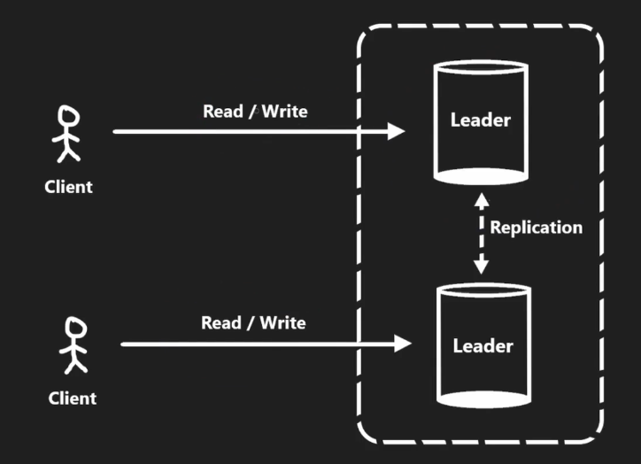

# 17. 复制与分片

在分布式数据库系统中，**复制** 和 **分片** 是两种核心机制，它们通常结合使用，用于解决数据扩展性和可靠性的问题。

- **复制**: 提高每个分片的可靠性、可用性和读取性能。
- **分片**: 水平扩展数据存储能力，处理海量数据。

## 复制 (Replication)

复制是将一份数据存储在多个节点上，确保数据高可用性，同时分担读写负载。根据不同场景，复制可以有以下策略：

### 1. 主从模式 (Leader-Followers Replication)


#### 工作方式

数据写入主节点 (Leader)，然后同步到从节点 (Followers)。主节点支持读写操作，从节点仅支持读取。

#### 更新方式

1. **异步更新**:
   - **特点**: 主节点在写入后异步将更新推送到从节点。
   - **优点**: 高性能，低延迟。
   - **缺点**: 可能造成数据不一致。用户读取从节点时，可能获取到旧数据。
   - **适用场景**: 高并发读取的系统，如缓存服务。
2. **同步更新**:
   - **特点**: 每次写操作需要同步到所有从节点后才完成。
   - **优点**: 数据一致性强。
   - **缺点**: 显著增加延迟，影响写入性能。
   - **适用场景**: 数据一致性要求高的系统。

#### 优点

1. 提高读性能：从节点分担读请求，实现**读扩展**。
2. 提高可靠性：主节点故障时，从节点可以接管。

#### 缺点

单一主节点的写性能是瓶颈。

---

### 2. 主主模式 (Leader-Leader Replication)



#### 工作方式

多个主节点同时负责读写操作，节点间同步更新。适用于跨地域分布的系统。

#### 优点

1. 提高写性能：分布式写入，支持更多并发操作。
2. 跨地域服务：每个地区的用户访问就近的主节点，提高性能。

#### 缺点

1. 数据冲突风险：两个主节点同时更新同一条记录可能导致数据不同步。
2. 高复杂性：需要额外的机制解决冲突（如时间戳或优先级规则）。

#### 适用场景

跨区域服务的全球应用，例如全球范围的电商或社交媒体。

## 分片 (Sharding)

### 1. 分片的含义

分片是将大规模的数据按某种规则划分成多个部分，每部分称为一个**分片 (Shard)**，分布存储在不同节点上。分片的目的是实现数据的水平扩展，使系统能够存储更多数据并承载更高的并发量。

---

### 2. 分片的策略

1. **基于范围的分片 (Range-Based Sharding)**:

   - **原理**: 根据某个字段的值范围划分数据。  
     例如，通过用户 ID，将 1-1000 分配到分片 A，1001-2000 分配到分片 B。
   - **优点**: 简单易实现，查询相邻范围数据时效率高。
   - **缺点**: 数据分布不均衡，某些范围可能产生热点问题。
   - **示例**:
     ```
     Shard A: 用户 ID 1 - 1000
     Shard B: 用户 ID 1001 - 2000
     ```
   - **适用场景**: 按地域、时间等有规律分布的数据。

2. **基于哈希的分片 (Hash-Based Sharding)**:

   - **原理**: 通过哈希函数将数据分布到各个分片，确保分布均匀。  
     例如：`shard = hash(user_id) % number_of_shards`。
   - **优点**: 数据分布均匀，避免热点问题。
   - **缺点**: 跨分片查询复杂，分片扩展时需要重新分布哈希值。
   - **应用**: 一致性哈希是这种分片策略的重要应用，用于动态扩展或收缩分片数量。

   **示例**:

   ```text
   用户 ID 23456 -> Hash % 3 = 0 -> Shard A
   用户 ID 78901 -> Hash % 3 = 2 -> Shard C
   ```

---

### 关系型数据库的分片挑战

传统关系型数据库 (如 MySQL、Postgres) 不具备原生分片功能。需要根据应用逻辑实现分片时，需要特别关注以下问题：

1. **跨分片查询**: 涉及多个分片的数据需要合并结果，查询复杂度提高。
2. **关系约束**: 分片后，表间关系约束 (如外键) 无法直接支持，需要应用层逻辑维护。

---

## 总结

分片和复制是分布式数据库设计中的基础技术：

- 复制提高了数据的可靠性和高可用性，同时分担读请求压力。
- 分片实现了系统水平扩展，支持海量数据存储和高并发处理。
- 在实际应用中，需要根据业务需求权衡一致性、性能和复杂性，选择合适的策略。
