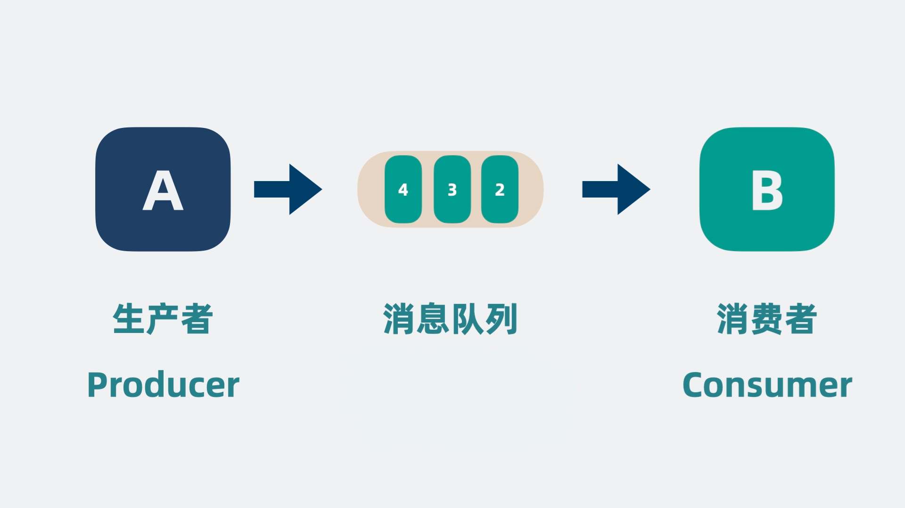
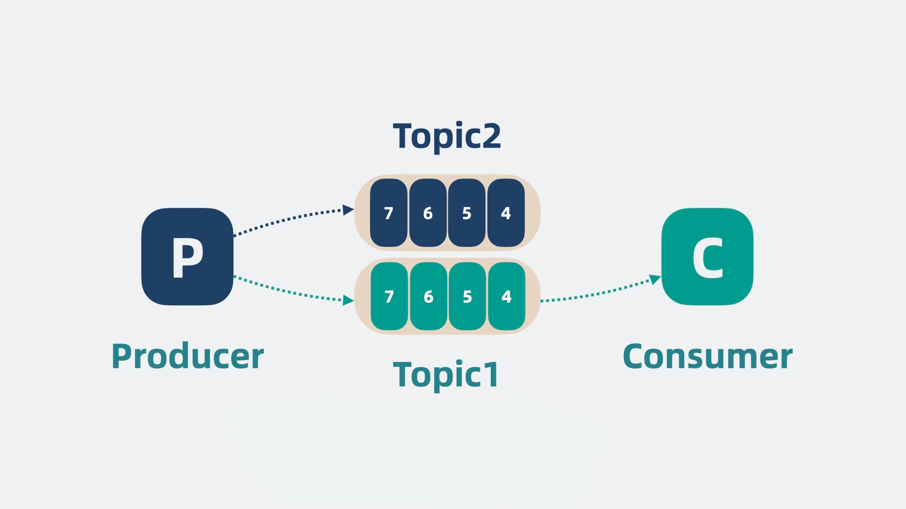
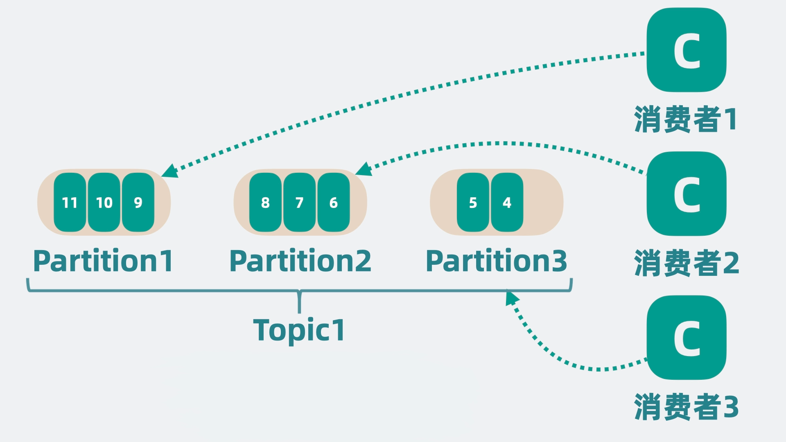
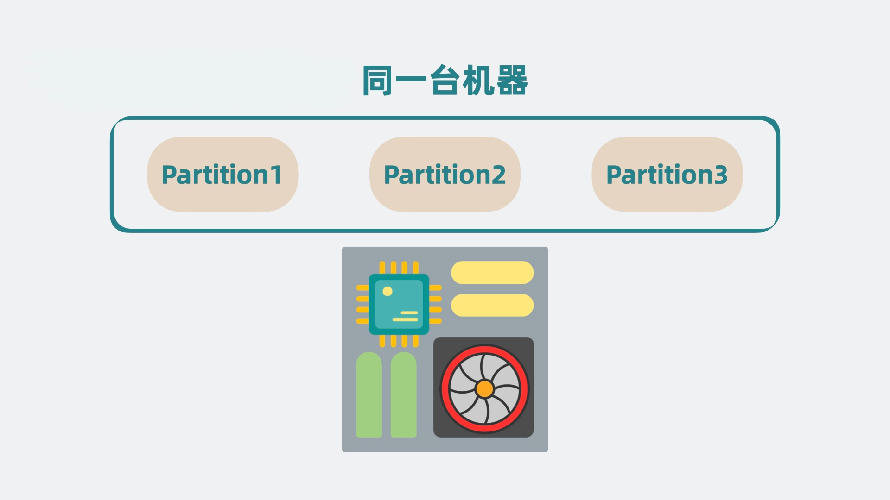
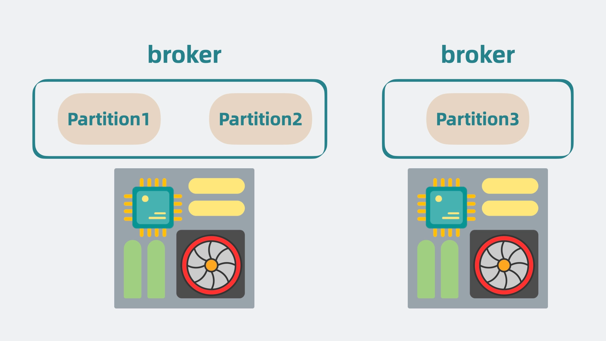
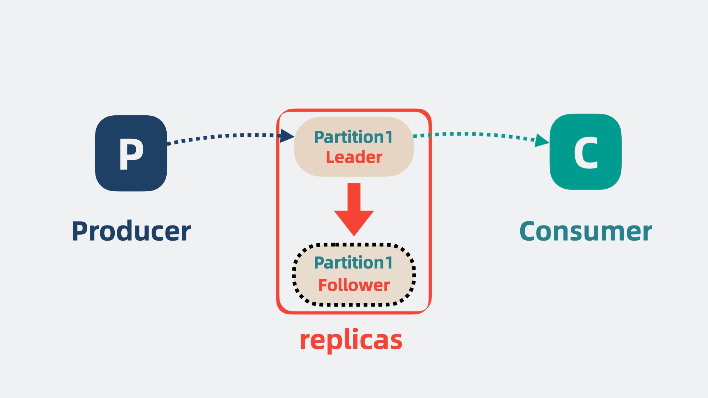
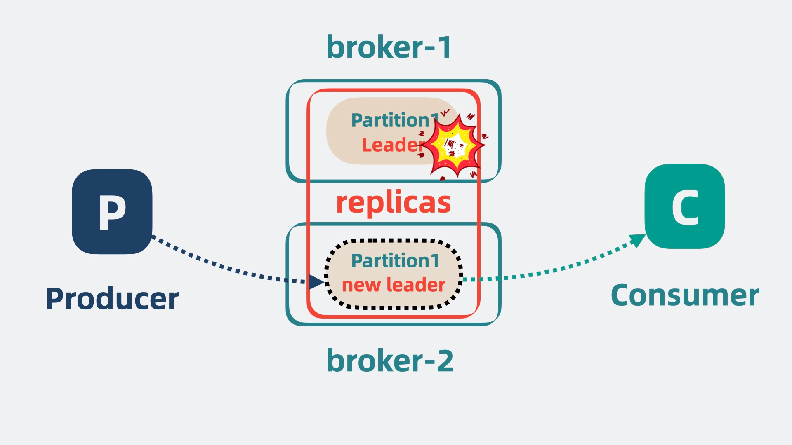

# 20. 消息队列

## 什么是消息队列

消息队列（Message Queue, MQ）是一种用于在分布式系统中实现异步通信的数据结构。消息队列通过在消息的发送方和接收方之间引入缓冲区，解耦了发送和接收流程，提高了系统的可扩展性和可靠性。它是现代软件架构中非常常见的工具，尤其在微服务、事件驱动设计和分布式系统中。

假设我们有两个服务：A 和 B。A 每秒生成 200 条消息，而 B 每秒只能处理 100 条消息。如果直接通信，B 很容易崩溃。为了缓解压力，我们可以在两者之间加入一个缓冲层，这就是消息队列的基本思想。

消息队列的核心是一个链表结构，每个节点存储一条消息，并通过 Offset 记录消息的位置。消费者按序处理这些消息，保证在自己的处理能力范围内运行。通过将队列从内存移至独立的进程，消息即使在服务重启时也能保留。

像 A 服务这样负责发数据到消息队列的角色，就是**生产者**，像 B 服务这样处理消息的角色，就是**消费者**。

### 消息队列的常见模式

1. **点对点模式（P2P, Point-to-Point）**
   - 每个消息只能被一个消费者处理。适用于任务分发场景，例如订单处理。
2. **发布/订阅模式（Pub/Sub）**
   - 消息会广播给所有订阅者，常用于事件通知和日志收集场景。

## 高性能

如果 B 服务由于性能较差，消息队列里会不断堆积数据，为了提升性能，我们可以扩展更多的消费者, 这样消费速度就上去了，相对的我们就可以增加更多生产者，提升消息队列的吞吐量。

随着生产者和消费者都变多，我们会发现它们会同时争抢同一个消息队列，抢不到的一方就得等待。

为了解决这个问题，可以对消息进行分类，每一类是一个 **topic**，然后根据 topic 新增队列的数量，生产者将数据按 topic 投递到不同的队列中，消费者则根据需要订阅不同的 topic。这就大大降低了 topic 队列的压力。

但单个 topic 的消息还是可能过多，我们可以将单个队列，拆成好几段，每段就是一个 **partition 分区**，每个消费者负责一个 partition。
这就大大降低了争抢，提升了消息队列的性能。

## 高扩展性

随着 partition 变多，如果 partition 都在同一台机器上的话，就会导致单机 cpu 和内存过高，影响整体系统性能。

于是我们可以申请更多的机器，将 partition 分散部署在多台机器上，这每一台机器，就代表一个 **broker**。我们可以通过增加 broker 缓解机器 cpu 过高带来的性能问题。

## 高可用

此时还有个问题，如果其中一个 partition 所在的 broker 挂了，那 broker 里所有 partition 的消息就都没了。

所以需要给 partition 多加几个副本，也就是 replicas，将它们分为 Leader 和 Follower。Leader 负责应付生产者和消费者的读写请求，而 Follower 只管同步 Leader 的消息。

将 Leader 和 Follower 分散到不同的 broker 上，这样 Leader 所在的 broker 挂了，也不会影响到 Follower 所在的 broker, 并且还能从 Follower 中选举出一个新的 Leader partition 顶上。这样就保证了消息队列的高可用。

## 持久化和过期策略

刚刚提到的是几个 broker 挂掉的情况，现在假设所有 broker 都挂了，数据就全丢了。

为了解决这个问题，我们不能光把数据放内存里，还要持久化到磁盘中，这样哪怕全部 broker 都挂了，数据也不会全丢，重启服务后，也能从磁盘里读出数据，继续工作。

但磁盘总是有限的，一直往里写数据迟早有一天会满，所以还需要给数据加上保留策略（retention policy），比如磁盘数据超过一定大小或消息放置超过一定时间就会被清理掉。

## Consumer Group

为了更灵活地满足不同业务需求，还需要引入**消费者组（Consumer Group）**的概念。一个消费者组由一组消费者实例组成，共同消费指定主题的消息。在同一消费者组内，每个 Partition 只能被一个消费者实例处理，确保消息不会被重复消费；而不同的消费者组可以独立消费相同的消息。

- **单一业务方扩展**：对于一个消费业务方（例如 B 服务），可以通过增加实例扩展消费能力，这些实例共享同一个消费者组，消费进度（Offset）统一维护。
- **多业务方解耦**：当新的业务方（例如 C 服务）需要处理相同的消息时，可以创建一个独立的消费者组，从头或指定 Offset 开始消费，不受 B 服务的影响。

消费者组机制允许消息队列在**水平扩展**和**业务独立性**之间取得平衡，使其适用于多种复杂场景。

## ZooKeeper

为了协调多个组件的状态和元数据，还需要引入**ZooKeeper**，它负责统一管理集群中的元数据，包括：

1. **Broker 状态**：实时监控每个 Broker 是否可用。
2. **Partition 元数据**：管理 Partition 的 Leader 和 Follower 信息。
3. **消费者组的 Offset 信息**：跟踪各组的消费进度。

ZooKeeper 定期与 Broker 和消费者通信，确保集群的一致性。当某个 Broker 挂掉时，ZooKeeper 会通知集群重新选举 Leader 或重新分配 Partition。

## Kafka

经过多轮优化后，最初简单的消息队列已经演变为一个**高性能、高扩展性、高可用**的分布式消息系统，这就是**Kafka**。

Kafka 的核心设计包括以下特点：

- **分区与分布式架构**：通过 Partition 提升并行处理能力，借助 Broker 分散负载，保障高扩展性。
- **副本与 Leader 机制**：通过副本提高数据可靠性，Leader 负责写入性能，Follower 提供高可用性。
- **持久化与策略管理**：磁盘日志持久化保护数据不丢失，灵活的 Retention 策略释放存储压力。
- **灵活的消费模式**：支持单一消费者和消费者组，满足多业务需求。

Kafka 被广泛应用于日志收集、实时数据流处理、事件驱动架构等场景，是现代分布式系统的核心中间件之一。

## 常见的消息队列

1. **RabbitMQ**：基于 AMQP 协议，功能丰富，支持复杂路由和持久化。
2. **Kafka**：高吞吐量，适合实时数据流处理和日志聚合。
3. **ActiveMQ**：开源消息队列，支持多种协议。
4. **Redis Streams**：Redis 提供的轻量级消息队列。
5. **Amazon SQS**：AWS 提供的完全托管的消息队列服务。

## 应用场景

1. **异步任务处理**：处理用户注册后的欢迎邮件、日志分析等非实时任务。
2. **事件驱动架构**：通过消息队列实现事件传播，例如用户触发行为后推送多种通知。
3. **分布式事务**：在分布式系统中，利用消息队列实现最终一致性。
4. **日志收集**：将分布式系统的日志聚合到消息队列，再进行统一分析和存储。
