# 3. 从零扩展到百万用户

在这篇文章里，我们将构建一个支持少量用户的系统，并逐步扩展以支持百万级用户。

## 单服务器设置

首先，我们将所有内容放在一台服务器上——Web 应用、数据库、缓存等。

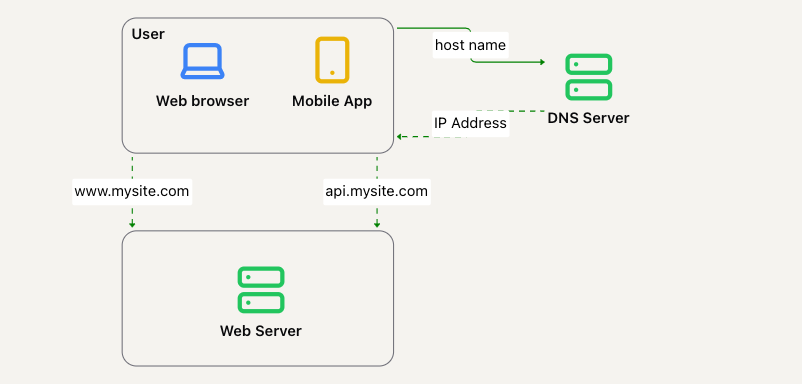

在这种情况下，请求流程是怎样的？

- 用户向 DNS 服务器请求我站点的 IP 地址（即 `api.mysite.com -> 15.125.23.214`）。通常，DNS 服务是由第三方提供，而不是自己托管。
- HTTP 请求从用户设备直接发送到服务器（通过其 IP）。
- 服务器返回 HTML 页面或 JSON 数据，用于渲染。

Web 服务器的流量来自 Web 应用或移动应用：

- Web 应用使用服务器端语言（如 Java、Python）处理业务逻辑和存储，客户端语言（如 HTML、JS）用于展示。
- 移动应用通过 HTTP 协议与 Web 服务器通信。JSON 用于格式化传输的数据。示例数据负载：

```
{
  "id": 12,
  "firstName": "John",
  "lastName": "Smith",
  "address": {
     "streetAddress": "21 2nd Street",
     "city": "New York",
     "state": "NY",
     "postalCode": 10021
  },
  "phoneNumbers": [
     "212 555-1234",
     "646 555-4567"
  ]
}
```

## 数据库

随着用户量的增加，将所有内容存储在单台服务器上已经不够用了。我们可以将数据库迁移到另一台服务器，这样它就可以独立于 Web 层进行扩展：

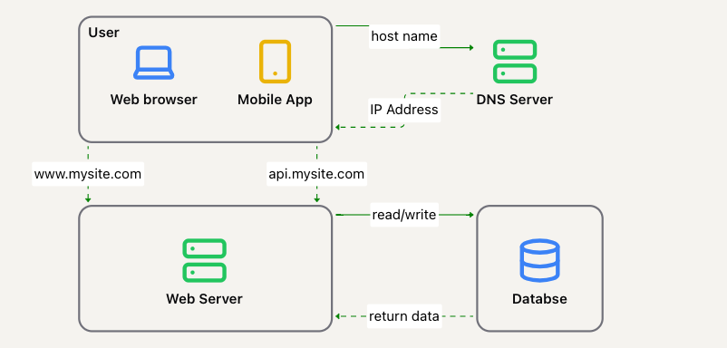

### 选择使用哪种数据库？

你可以选择传统的关系型数据库，或者选择非关系型（NoSQL）数据库。

- 最流行的关系型数据库 - MySQL、Oracle、PostgreSQL。
- 最流行的 NoSQL 数据库 - CouchDB、Neo4J、Cassandra、HBase、DynamoDB。

关系型数据库通过表格和行来表示和存储数据。你可以连接不同的表来表示聚合对象。  
NoSQL 数据库被分为四类 - 键值存储、图形存储、列存储和文档存储。一般不支持连接操作。

对于大多数用例，关系型数据库是最佳选择，因为它们存在的时间最长，且在历史上表现良好。

如果关系型数据库不适用，可能值得探索 NoSQL 数据库。如果：

- 应用程序需要超低延迟。
- 数据是非结构化的，或不需要关系数据。
- 只需要序列化/反序列化数据（如 JSON、XML、YAML 等）。
- 需要存储大量数据。

## 垂直扩展与水平扩展

垂直扩展 == 向上扩展。这意味着给服务器添加更多的计算能力——CPU、RAM 等。

水平扩展 == 向外扩展。增加更多的服务器到资源池中。

垂直扩展适用于流量较低时。其主要优点是简单，但也有一些局限性：

- 有硬性限制。无法无限制地为单台服务器增加 CPU 或 RAM。
- 缺乏故障转移和冗余。如果服务器宕机，整个应用或网站也会随之宕机。

水平扩展更适用于大型应用，因为垂直扩展存在的局限性。其主要缺点是实现起来较为复杂。

在目前的设计中，服务器宕机（例如由于故障或超载）意味着整个应用都将随之宕机。  
解决这个问题的一个好方法是使用负载均衡器。

## 负载均衡器

负载均衡器将传入的流量均匀分配到负载均衡集中的多个 Web 服务器上：

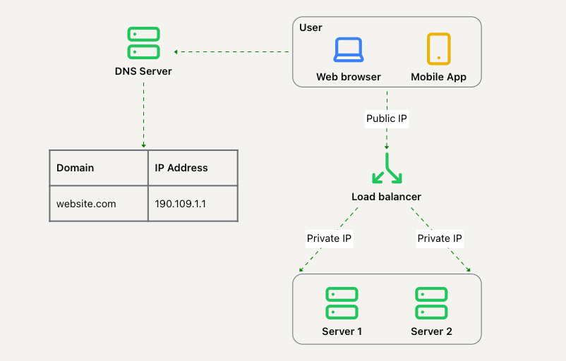

客户端通过负载均衡器的公共 IP 地址进行连接，Web 服务器无法直接被客户端访问，它们具有私有 IP，负载均衡器可以访问这些 IP。

通过添加负载均衡器，我们成功地提高了 Web 层的可用性，并为故障转移提供了可能。

### 工作原理

- 如果服务器 1 宕机，所有流量将路由到服务器 2，这样可以防止网站下线。我们还可以再添加一台新服务器来平衡负载。
- 如果网站流量激增，两台服务器无法处理流量时，负载均衡器可以通过添加更多服务器来优雅地应对。

Web 层现在看起来很强大。那么数据层呢？

## 数据库复制

数据库复制通常通过主/从复制实现（顺便提一下，现如今通常称之为主/从复制，或主/次复制）。

主数据库通常只支持写操作。从数据库存储主数据库的数据副本，只支持读操作。  
这种设置适用于大多数应用程序，因为通常读取操作远多于写入操作。通过添加更多的从实例，读取操作可以轻松扩展。

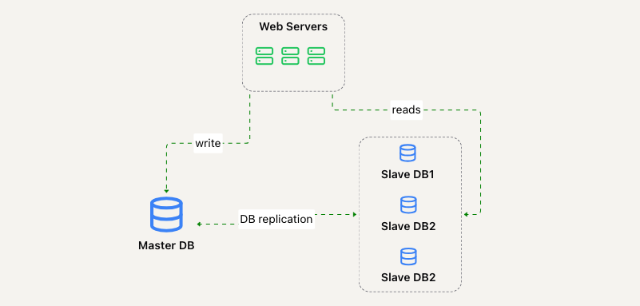

### 优势

- **更好的性能**：允许更多的读请求并行处理。
- **可靠性**：如果一个数据库损坏，数据仍然可以保留。
- **高可用性**：只要有一个实例在线，数据就可以访问。

如果一个数据库宕机怎么办？

- 如果从数据库宕机，读操作将临时路由到主数据库或其他从数据库。
- 如果主数据库宕机，一个从实例将被提升为新的主数据库。一个新的从实例将取代旧的主数据库。


这是精炼后的请求生命周期：

- 用户通过 DNS 获取负载均衡器的 IP 地址
- 用户通过 IP 连接到负载均衡器
- HTTP 请求被路由到服务器 1 或服务器 2
- Web 服务器从从数据库实例读取用户数据或将数据修改请求路由到主数据库实例

太好了，现在我们通过添加缓存并将静态内容移到 CDN 来提高负载/响应时间。

## 缓存

缓存是一个临时存储层，用于存储频繁访问的数据或昂贵计算的结果。

在我们的 Web 应用中，每次加载网页时，都会向数据库发送昂贵的查询。  
我们可以通过使用缓存来缓解这个问题。

### 缓存层

缓存层是一个临时存储区域，数据从缓存中获取的速度比从数据库中获取要快得多。  
它还可以独立于数据库进行扩展。

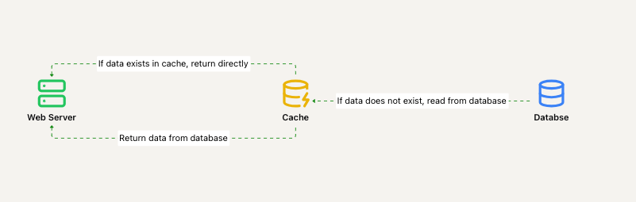

上面的示例是一个读通过缓存的缓存（read-through cache）——服务器检查数据是否在缓存中。如果不在，则从数据库获取数据。

### 使用缓存时的考虑事项

- **何时使用**：通常在数据读取频繁但修改不频繁时使用。缓存通常不会在重启时保存数据，因此它不是一个良好的持久化层。
- **过期策略**：控制缓存数据是否（以及何时）过期并被删除。过期时间太短，数据库将被频繁查询；过期时间太长，数据将变得陈旧。
- **一致性**：数据存储与缓存应保持多少同步？如果数据库中的数据更改，但缓存没有更新，就会发生不一致。
- **应对失败**：单个缓存服务器可能成为单点故障（SPOF）。考虑为其提供更多的内存，或在多个位置部署缓存服务器。
- **逐出策略**：当缓存已满时，如何添加新的数据项？缓存逐出策略控制这一点。常见策略包括 LRU（最近最少使用）、LFU（最少使用）和 FIFO（先进先出）。

## 内容分发网络（CDN）

CDN 是由地理上分布的多个服务器组成的网络，用于分发静态内容——如图像、HTML、CSS 和 JS 文件。

每当用户请求静态内容时，离用户最近的 CDN 服务器将为其提供内容：


以下是请求流程：


- 用户通过 URL 请求图像。URL 由 CDN 提供，例如 `https://mysite.cloudfront.net/logo.jpg`
- 如果图像不在缓存中，CDN 会从源服务器（例如 Web 服务器、S3 桶等）请求该文件。
- 源服务器返回图像到 CDN，并附带一个可选的 TTL（生存时间）参数，用于控制该静态资源在缓存中的存储时间。
- 后续用户可以直接从 CDN 获取该图像，直到 TTL 过期，而无需再请求源服务器。

### 使用 CDN 时的考虑事项

- **成本**：CDN 由第三方管理，你需要为其付费。请注意不要将访问频率较低的数据存储在 CDN 中。
- **缓存过期**：考虑适当的缓存过期时间。过短会导致频繁访问源服务器，过长则会导致数据变陈旧。
- **CDN 回退**：如果 CDN 提供商出现临时故障，客户端应能够绕过该 CDN 提供商。
- **失效处理**：可以通过 API 调用或传递对象版本来执行。

优化后的 Web 应用架构：

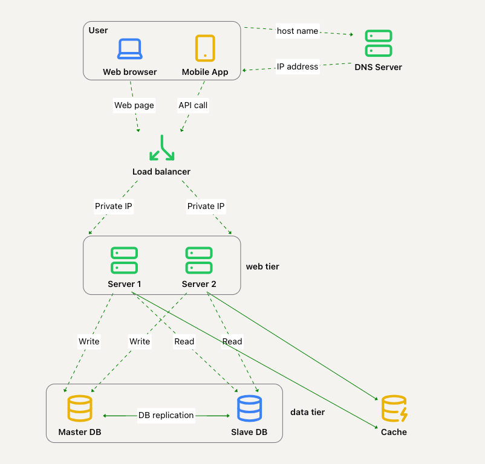

## 无状态 Web 层

为了扩展我们的 Web 层，我们需要将其设计为无状态。

为此，我们可以将用户会话数据存储在持久化数据存储中，例如我们的关系型数据库或 NoSQL 数据库。

### 有状态架构

有状态服务器会在不同的请求之间记住客户端的数据。无状态服务器则不会。

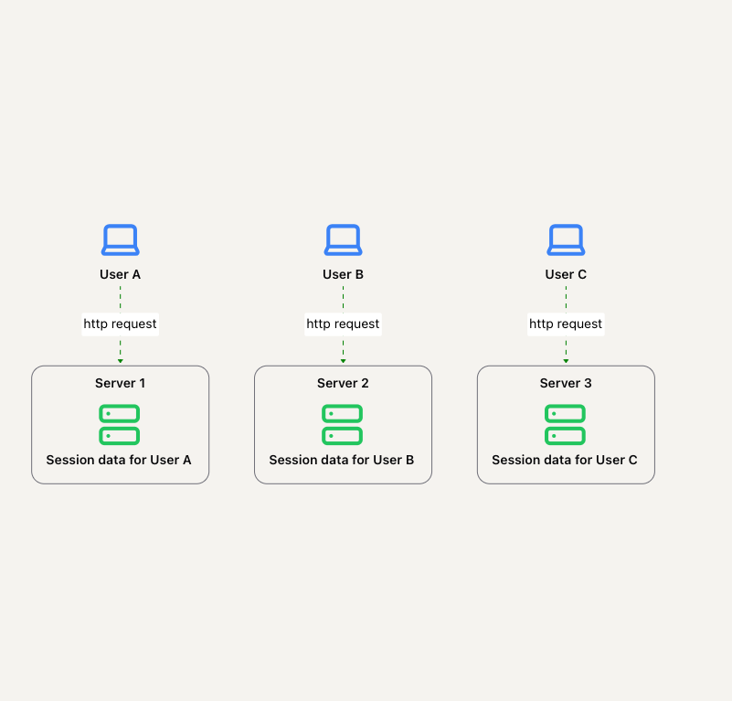

在上述情况下，用户与存储其会话数据的服务器绑定。如果他们向另一个服务器发起请求，另一个服务器将无法访问该用户的会话数据。

这一问题可以通过粘性会话（sticky sessions）来解决，大多数负载均衡器都支持这一功能，但这会增加额外的开销。  
添加或移除服务器变得更加困难，这限制了我们在服务器故障时的选择。

### 无状态架构


在这种情况下，服务器本身不会存储任何用户数据。  
相反，服务器将数据存储在一个所有服务器都可以访问的共享数据存储中。

这样，来自用户的 HTTP 请求可以由任何 Web 服务器来处理。

更新后的 Web 应用架构：

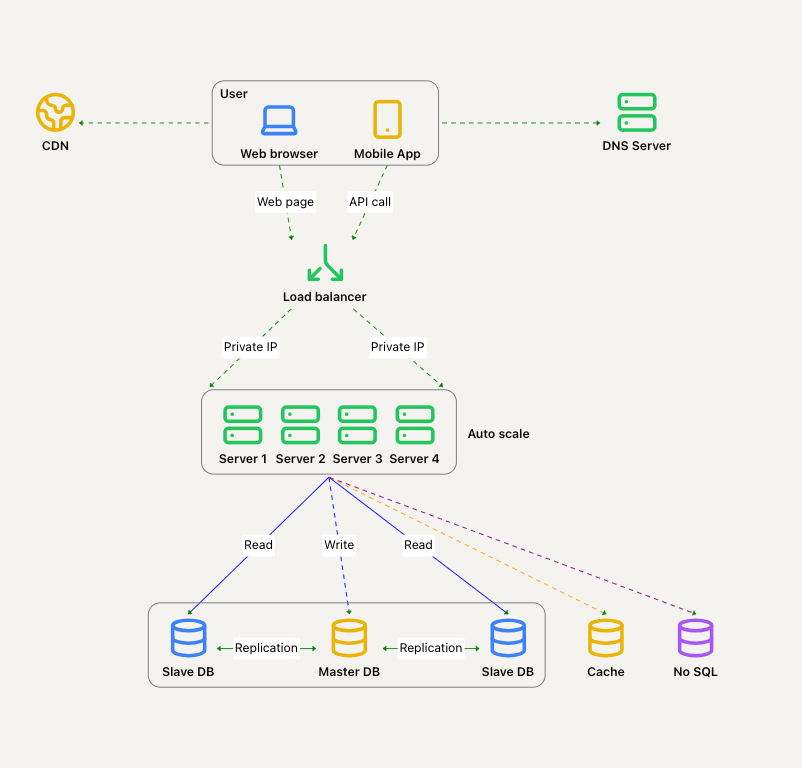

用户会话数据存储可以是关系型数据库或 NoSQL 数据存储，这种存储更容易扩展以支持这类数据。  
应用程序演进的下一步是支持多个数据中心。

## 数据中心


在上述示例中，客户端根据 IP 地址被地理路由到最近的数据中心。

如果发生故障，我们会将所有流量重定向到健康的数据中心：

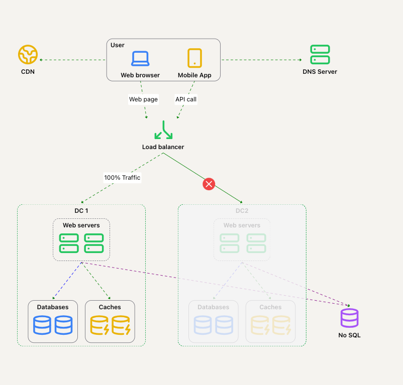

为了实现这种多数据中心设置，我们需要解决一些问题：

- **流量重定向**：需要工具正确地将流量引导到正确的数据中心。可以使用 GeoDNS 来实现这一点。
- **数据同步**：在故障切换的情况下，DC1 的用户需要访问 DC2。如果他们的用户数据不存在于 DC2 中怎么办？
- **测试和部署**：自动化部署和测试对于保持多个数据中心之间的一致性至关重要。

为了进一步扩展系统，我们需要解耦不同的系统组件，使它们能够独立扩展。

## 消息队列

消息队列是持久化组件，用于实现异步通信。


基本架构：

- 生产者创建消息。
- 消费者/订阅者订阅新消息并进行消费。

消息队列使生产者与消费者解耦。
如果消费者宕机，生产者仍然可以发布消息，消费者可以稍后接收这些消息。

我们应用中的示例用例 - 照片处理：

- Web 服务器将“照片处理任务”发布到消息队列。
- 一个可伸缩的工作进程（可以动态增加或减少数量）订阅队列并处理这些任务。

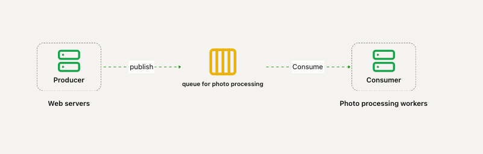

## 日志记录、度量与自动化

当你的 Web 应用规模达到一定程度时，投资于监控工具变得至关重要。

- **日志记录**：错误日志可以被输出到数据存储，之后可以由服务运维人员读取。
- **度量**：收集各种类型的度量帮助我们获取业务洞察并监控系统健康状况。
- **自动化**：投资于持续集成，如自动构建、测试和部署，可以尽早发现各种问题，并提高开发人员的生产力。

更新后的系统设计：

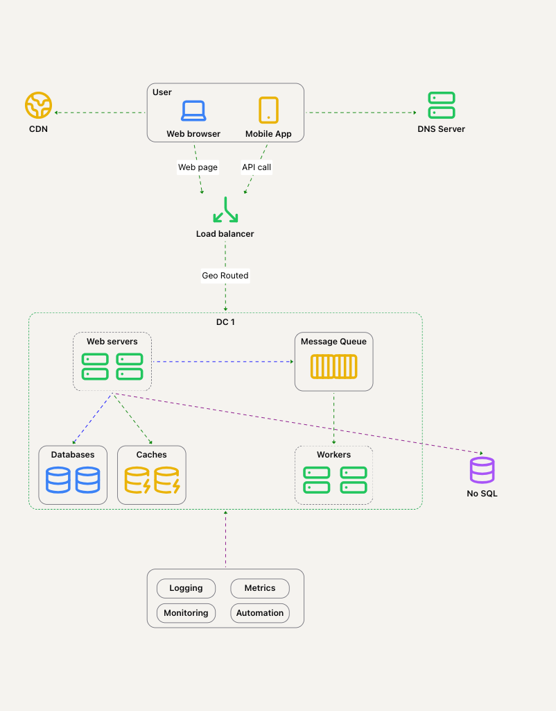

## 数据库扩展

数据库扩展有两种方法：垂直扩展和水平扩展。

### 垂直扩展

也称为向上扩展，指的是为数据库节点增加更多物理资源——如 CPU、内存、硬盘等。
例如，在 Amazon RDS 中，你可以获得一个具有 24 TB 内存的数据库节点。

这种数据库可以处理大量数据——例如，stackoverflow 在 2013 年拥有 1000 万月独立访客，且只使用了单个数据库节点。

然而，垂直扩展也有一些缺点：

- 对于向节点中添加资源的数量有硬件限制。
- 仍然存在单点故障。
- 总体成本较高——强大的服务器价格昂贵。

### 水平扩展

与其添加更大的服务器，不如增加更多的服务器：


**分片**是一种数据库水平扩展方式，它将大数据集分割成更小的部分。
每个分片共享相同的模式，但实际数据是不同的。

一种分片数据库的方法是基于某个键，将该键均匀地分配到所有分片中，通常使用取模运算符：


以下是该示例中用户数据的样子：

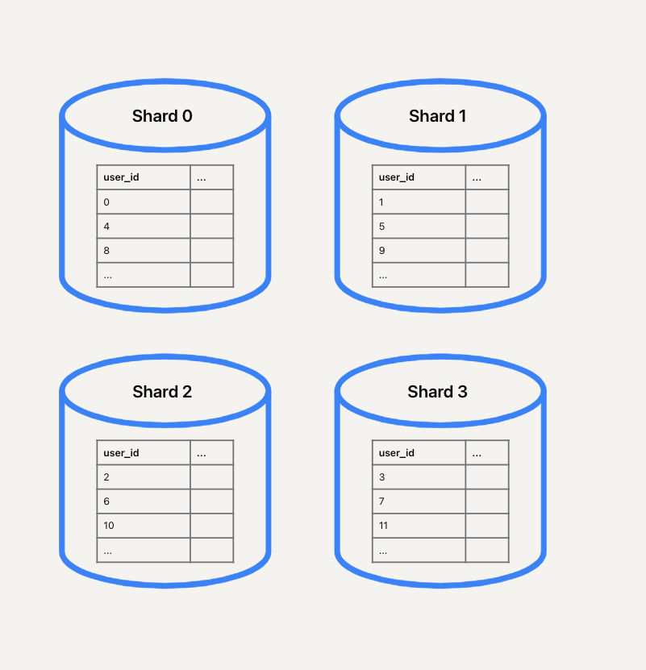

**分片键**（又称分区键）是使用分片时最重要的考虑因素。
特别地，应该选择一个能够尽可能均匀分布数据的键。

尽管分片是一种有用的技术，但它也为系统带来了很多复杂性：

- **重新分片**：如果某个分片的数据量增长过大，你需要重新分片。若数据分布不均，数据增长过快，可能会很快遇到这个问题。**一致性哈希**有助于避免移动过多的数据。
- **名人问题（又称热点）**：某个分片可能会比其他分片更频繁地被访问，导致该分片负载过重。我们可能需要为某些“名人”用户使用独立的分片。
- **联接与反规范化**：在不同分片之间进行联接操作会变得非常困难。一种常见的解决方案是反规范化表，避免执行联接操作。

以下是我们应用架构引入分片和 NoSQL 数据库（用于存储一些非关系型数据）后的样子：

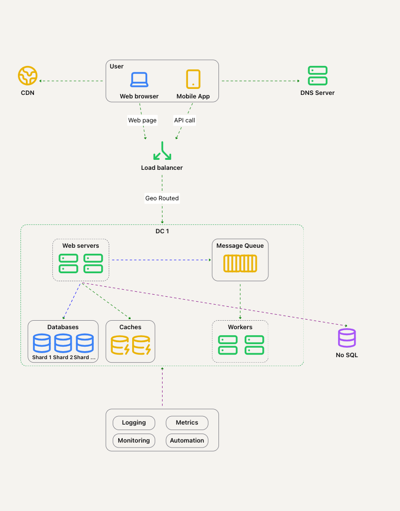

## 数百万用户及其扩展

扩展系统是一个迭代过程。

到目前为止，我们学到的技术可以帮助我们走得很远，但为了将应用扩展到数百万用户，可能需要应用更复杂的技术。

到目前为止的技术可以为我们提供一个良好的基础。

以下是总结：

- 保持 Web 层无状态
- 在每一层构建冗余
- 缓存频繁访问的数据
- 支持多个数据中心
- 将静态资产托管在 CDN 中
- 通过分片扩展数据层
- 将大型应用拆分为多个服务
- 监控系统并使用自动化
