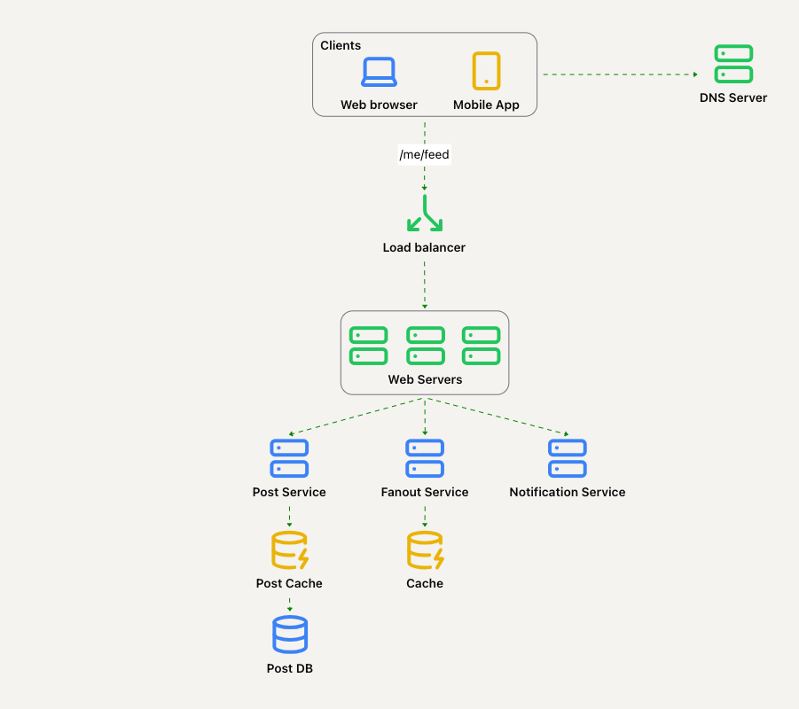

# 11. 设计新闻推送系统

新闻推送系统（News Feed）是一个不断更新的首页故事列表，包括状态更新、照片、视频、链接等内容。

类似的面试题有：**设计 Facebook News Feed、Twitter 时间线、Instagram Feed** 等。

## 第一步：理解问题并明确设计范围

在设计之前，与面试官讨论清楚具体的需求至关重要：

- **候选人**：这系统是面向移动端，还是 Web 应用？
- **面试官**：两者都需要支持。
- **候选人**：系统的核心功能是什么？
- **面试官**：用户能够发布帖子，并在新闻推送中查看朋友的帖子。
- **候选人**：新闻推送是按时间顺序排序，还是基于排名（如优先显示“好友”的帖子）？
- **面试官**：为了简化问题，按时间逆序排列即可。
- **候选人**：单个用户的好友数量是否有限制？
- **面试官**：每个用户最多可以有 5000 个好友。
- **候选人**：系统需要支持的流量量级是？
- **面试官**：目标是支持每日活跃用户数（DAU）达到 1000 万。
- **候选人**：Feed 是否支持富媒体内容？
- **面试官**：可以，允许图片和视频。

## 第二步：提出高层设计并获得认可

设计系统主要包含两个核心流程：

1. **帖子发布**：用户发布帖子后，相应数据会写入缓存和数据库，同时推送到好友的新闻推送中。
2. **新闻推送构建**：通过聚合好友的帖子生成新闻推送。

---

### 新闻推送 API 设计

新闻推送 API 是用户访问新闻的主要入口，以下是主要的 API 端点：

- `POST /v1/me/feed`：发布新帖子，需提交 `content` 和 `auth_token`。
- `GET /v1/me/feed`：获取新闻推送，需提交 `auth_token`。

---

### 帖子发布流程

1. 用户通过 API 提交帖子内容。
2. **负载均衡器**：将请求分发到 Web 服务器。
3. **Web 服务器**：将请求路由到内部服务。
4. **发布服务**：将帖子持久化到数据库并缓存。
5. **扩散服务**：将帖子推送到好友的新闻推送中。
6. **通知服务**：通知用户的好友内容已更新。

---

### 新闻推送构建流程

1. 用户发送获取新闻推送的请求。
2. **负载均衡器**：将请求重定向至 Web 服务器。
3. **Web 服务器**：将请求转发至新闻推送服务。
4. **新闻推送服务**：从缓存中提取预计算的新闻推送。
5. **新闻推送缓存**：保存好友帖子 ID 列表以便快速检索。

## 第三步：深入设计分析

接下来深入探讨帖子发布和新闻推送构建这两个核心流程。

### 帖子发布流程

Web 服务器，除了路由和身份验证，服务器还需应用限流机制以防垃圾信息泛滥。

#### 扩散服务

- 扩散服务的职责是将帖子分发到好友的新闻推送中。
- 有两种主要策略：
  1. **写时扩散（Push Model）**：帖子在发布时预先推送到好友的新闻推送中。
     - **优点**：生成的新闻推送即时可用。
     - **缺点**：对于好友数目多的用户，推送需要花费很多时间，导致发布帖子速度变慢，会导致热键问题。对于不活跃的用户，预计算推送也是一种浪费。
  2. **读时扩散（Pull Model）**：帖子在好友请求新闻推送时动态生成。
     - **优点**：更高效地服务不活跃用户。
     - **缺点**：每次访问新闻推送都需要额外的计算，速度较慢。

---

#### 扩散服务架构

1. 从图数据库中获取好友 ID 列表，图数据库适合管理朋友关系和推荐。
2. 从用户缓存中获取朋友信息，此处会进行过滤，例如被屏蔽的朋友。
3. 将好友列表和帖子 ID 推送至消息队列。
4. 构建工作进程从消息队列中获取任务，并将新闻推送写入缓存。它们被存储为`<post_id, user_id>`映射，之后可以检索。

---

### 新闻推送构建流程

1. 用户发送请求以获取新闻推送。
2. **负载均衡器**：分配请求到 Web 服务器。
3. **Web 服务器**：转发请求至新闻推送服务。
4. **新闻推送服务**：从缓存中获取好友帖子 ID 列表。
5. **内容加载**：根据帖子 ID 加载对应的帖子内容和用户信息。
6. **返回结果**：生成的 JSON 数据通过 API 返回客户端。
7. **媒体文件优化**：图片和视频存储在 CDN 中以提高加载速度。

---

### 缓存架构设计

缓存是新闻推送系统的重要组成部分，分为以下五个层次：

1. **新闻推送缓存**：保存新闻推送中的帖子 ID 列表。
2. **内容缓存**：存储每个帖子的详细信息，包括文本、图片等，热门内容存储在热缓存中。
3. **社交图谱缓存**：保存好友关系和推荐信息。
4. **操作缓存**：记录用户点赞、评论等操作。
5. **计数器缓存**：存储帖子点赞数、评论数、关注数等计数器。

## 第四步：总结与讨论

我们设计了一个新闻推送，涵盖了两个主要用例：**帖子发布**和**新闻推送构建**。

### 与扩展性相关的讨论点

- 垂直扩展 vs. 水平扩展
- SQL vs. NoSQL 数据库选择
- 数据库主从复制与读取副本
- 数据一致性模型
- 数据库分片设计

### 其他讨论点

- 保持 Web 层无状态。
- 广泛使用缓存以优化性能。
- 支持多数据中心部署以提高可靠性。
- 利用消息队列解耦组件。
- 监控系统关键指标，如 QPS 和延迟，确保高性能和稳定性。
